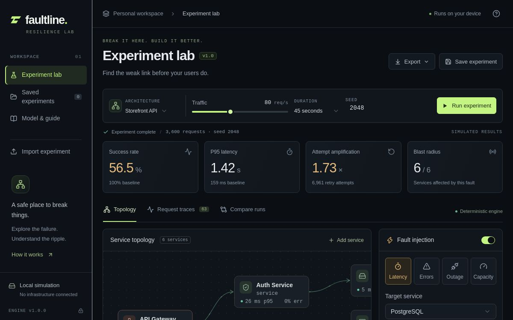

# Faultline

A local-first, deterministic resilience lab for developers. Edit a service dependency graph, inject a failure, compare it with a no-fault baseline, inspect request traces, and export an experiment that anyone can replay.

No API keys or real infrastructure traffic. Results describe the model, not production measurements.

## Preview



The screenshot above is the deployed workspace view. The interactive Site is available at [faultline-lab.alwanjuliawan02.chatgpt.site](https://faultline-lab.alwanjuliawan02.chatgpt.site).

## Features

- Editable DAGs with 1–12 reachable services and up to six dependencies each.
- Storefront, AI inference and SaaS templates.
- Latency spikes, probabilistic errors, outages and capacity reduction.
- Per-attempt timeouts, nested retries, exponential backoff, jitter and circuit breakers.
- Success rate, p95 latency, attempt amplification, blast radius, arrival-cohort charts and sampled request waterfalls.
- Device-local saved runs, historical comparison, validated JSON import and full report export.
- Dependency-free Node replay export with optional CI error-rate threshold.

## Development

Node 22.13+ is required by the application stack. The standalone engine and replay need Node 18+.

```sh
npm ci
npm run dev
npm run test:engine
npm run typecheck
npm run build
npm test
```

The application uses React, TypeScript, Vinext/Vite and Shadcn/Radix primitives. No application secrets, database or environment variables are needed. `npm test` builds and checks the engine, replay, rendered HTTP response and inherited UI primitives. Browser interaction testing is not included.

## CLI and CI

```sh
node scripts/faultline.mjs examples/experiments/storefront.json
node scripts/faultline.mjs examples/experiments/storefront.json --max-error-rate 1
```

The CLI accepts an experiment configuration or exported report and prints the full recomputed report. Exit status: 0 for a completed run within the optional threshold; 1 if the simulated root error percentage exceeds it; 2 for invalid input or complexity limits. This checks an architecture model, not a deployed service or repository implementation.

The UI's **Export → Standalone Node replay** downloads one file containing the engine and last completed configuration:

```sh
node faultline-replay.mjs --max-error-rate 1
```

## Model semantics

1. Fixed-rate arrivals: at most 200 requests/second for 90 seconds. All arrivals are followed through completion, even beyond this window.
2. Local latency is base × seeded uniform variation in `[0.75, 1.25)`. Counter-based noise is keyed by seed, root request, dependency path, retry index and draw purpose. Identical configurations and engine versions reproduce identical reports.
3. Local work precedes parallel required dependency calls. All dependencies must succeed. Failure cancels sibling calls. Shared descendants can be called separately by multiple parents.
4. Finite concurrency slots are held through local work and dependencies. There is no queue. Excess attempts return overloaded after 1 ms.
5. An attempt timeout covers dependencies and propagates cancellation. This assumes remote work can be stopped; many real systems cannot guarantee this.
6. Up to two retries per service invocation. Backoff is base × 2^retryIndex. Full jitter draws uniformly from zero to that delay. Nested retries can multiply attempts, and a parent deadline can cancel a child early.
7. Circuit state is shared per service. Five consecutive failed attempts open it for five seconds. One half-open probe is then admitted. Success closes it; failure reopens it. Rejections consume no service slots. No fallback is modeled.
8. Faults apply to attempts beginning in the start-inclusive, end-exclusive window. In-flight work retains its original behavior. Error probability is the greater of background and injected probability. Capacity is the selected percentage of normal slots, floored, with a minimum of one. Outages return unavailable after at most 10 ms.
9. Work is bounded before allocation: at most 30,000 live pending events and 2,000,000 scheduled events. Completed timers release callbacks; cancelled events are compacted. Dense valid graphs may be rejected rather than produce a partial report.

Service kinds identify roles. The model does not implement cache hits, database transactions, real protocols, consistency, stochastic arrivals, uncancellable background work or calibrated production predictions.

## Metrics

| Metric | Definition |
| --- | --- |
| Success rate | Successful root requests / all scheduled roots. |
| Root p95 | Nearest-rank 95th percentile of all root response times, including failures. Fast failures can lower it while availability worsens. |
| Attempt amplification | Physical service attempts / paired baseline attempts. Includes capacity rejection, excludes circuit rejection. |
| Service error rate | Failed completed attempts / non-cancelled attempts. |
| Blast radius | Services with error-rate increase over 1 percentage point; p95 increase over both 20 ms and 50%; extra cancellations; or extra circuit rejections. |
| Chart | Root p95 grouped by arrival second, not completion second. |

The baseline retains background errors, traffic, seed, topology and policy. It removes only the injection. Historical comparisons may use different configurations; the UI shows traffic, duration and seed of the reference. Up to approximately 64 root requests are sampled, with at most 160 spans per trace. Event logs retain 160 events. Aggregate metrics count all completed work.

## Source

- `public/faultline-engine.mjs`: validation and dependency-free discrete-event engine.
- `public/simulation-worker.js`: isolated browser worker bridge.
- `components/faultline/`: working surface, editors, graph, chart and results.
- `lib/presets.ts`: architecture templates.
- `lib/replay.mjs`: portable Node script generation.
- `scripts/faultline.mjs`: repository CLI.
- `tests/faultline-*.test.mjs`: deterministic behavior, bounded-memory regression and portable replay tests.

`.openai/hosting.json` is the Sites deployment identity. Remove its project identity before independently registering a fork. `scripts/types-config.json` is only for runtime type generation, not deployment. The Cloudflare declaration file can be regenerated with:

```sh
npx wrangler types worker-configuration.d.ts --config scripts/types-config.json --env-interface FaultlineRuntimeEnv
```

For changes to model semantics, add a small hand-checkable fixture and a regression test. Keep the engine independent of framework and network dependencies. Bug reports should include the exported configuration and observed outcome.

Background reading: [Amazon Builders’ Library on timeouts, retries and jitter](https://aws.amazon.com/builders-library/timeouts-retries-and-backoff-with-jitter/). Faultline is an independent simplified implementation, not an AWS model or validation tool.

Original Faultline code is MIT licensed. Dependencies, bundled framework code and generated declarations retain their licenses.
